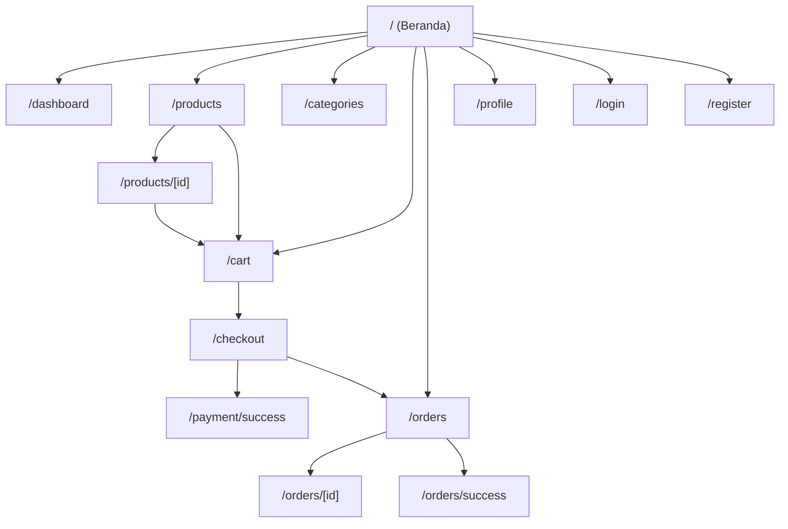
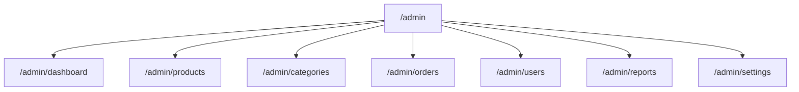

# Sitemap

## User Sitemap

## Admin Sitemap

## Catatan

- Route user dan admin diambil dari struktur `frontend/app`.
- Beberapa halaman bersifat protected, jadi aksesnya bergantung pada status login dan role user.
- Jika dibutuhkan, sitemap ini bisa saya pecah lagi menjadi versi visual yang lebih detail per flow, misalnya alur belanja, alur pembayaran, atau alur admin.
